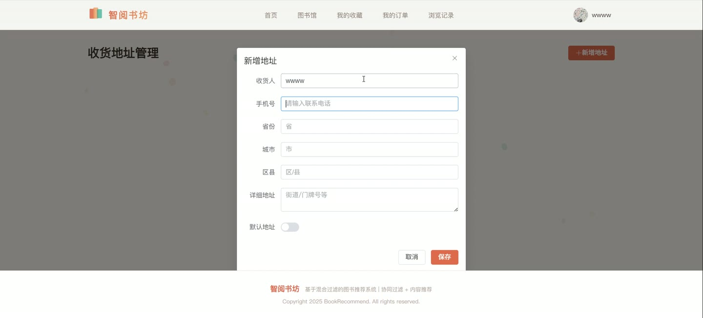
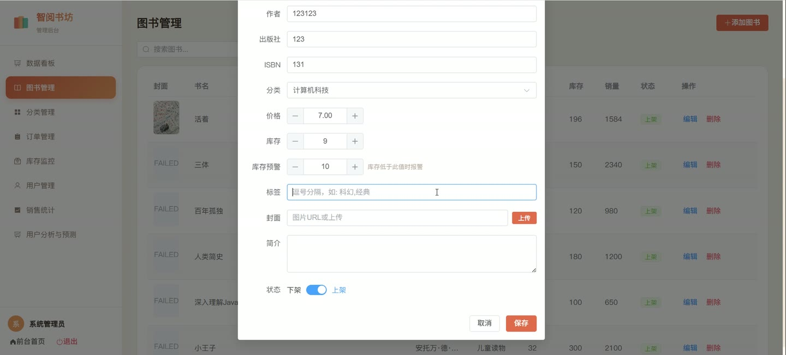
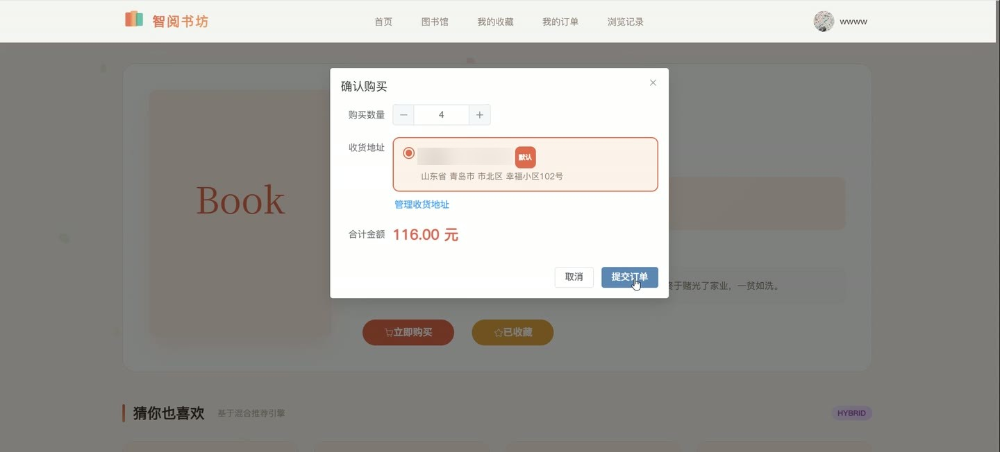
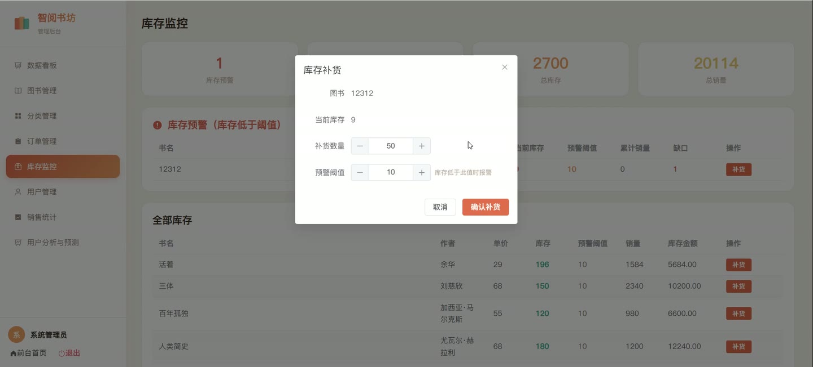

# (附文档)Springboot3+Vue3+MySQL 基于混合过滤的图书推荐系统

**技术栈**：Springboot3、Vue3、MySQL

### 系统简介

本系统是一个基于 Spring Boot 3 + Vue 3 + MySQL 的图书推荐与销售平台，采用前后端分离架构。系统内置普通用户和管理员两种角色，核心特色是实现了基于混合过滤的推荐引擎，融合协同过滤与基于内容的推荐算法，为用户提供个性化图书推荐。平台涵盖图书浏览、购物下单、收藏管理、地址管理、浏览历史、用户行为记录以及后台数据看板、用户深度分析等功能模块。
 
### 核心功能
 
### 普通用户端

 
- 图书浏览：查看图书列表，支持按书名、作者、标签关键词搜索，以及按分类筛选，分页展示。 
- 图书详情：查看图书的封面、作者、出版社、ISBN、价格、库存、简介、标签、所属分类名称。 
- 个性化推荐：系统根据用户的历史行为（浏览/收藏/购买/评分），通过混合推荐算法（协同过滤 60% + 基于内容 40%）生成推荐图书列表，并自动排除已购图书。 
- 热门图书：查看按销量降序排列的热门图书列表（默认取前 8 本）。 
- 新书上架：查看按创建时间降序排列的最新图书列表（默认取前 8 本）。 
- 分类浏览：按图书分类查看该分类下的所有在售图书。 
- 收藏管理：对图书进行收藏或取消收藏（切换操作），查看自己的收藏列表，列表中显示图书信息。 
- 购物下单：选择图书和数量、填写收货地址，提交订单生成订单记录，下单时自动扣减库存并增加销量，同时记录购买行为。 
- 订单管理：查看自己的订单列表，支持按订单状态筛选，查看订单详情（含订单号、总金额、状态、地址、物流单号、订单项及每项图书封面和书名）。 
- 收货地址管理：添加、编辑、删除收货地址，设置默认地址（设置默认时自动清除其他默认地址）。 
- 浏览历史：查看自己的浏览记录（按图书去重，保留最新浏览时间），展示图书信息。 
- 用户信息管理：查看和修改个人资料（昵称、头像、邮箱、手机号），修改登录密码。 
- 用户注册与登录：注册新账号（用户名唯一性校验，密码 MD5 加密），登录验证用户名/密码/状态，登录后根据角色跳转对应首页。
 
### 管理员端

 
- 数据看板：查看平台核心统计数据，包括用户总数、图书总数、订单总数、销售总额、浏览/收藏/购买/评分行为次数。 
- 图书管理：添加、编辑、删除图书；编辑时支持上传封面图片；设置图书的上架/下架状态、库存预警阈值；按书名/分类搜索图书。 
- 分类管理：添加、编辑、删除图书分类，支持设置排序顺序。 
- 订单管理：查看所有订单列表，按用户或状态筛选；修改订单状态（如发货、完成），填写物流单号；查看订单详情。 
- 库存监控：查看图书库存列表，关注库存低于预警值的图书。 
- 用户管理：查看用户列表，按用户名/昵称搜索；启用或禁用用户账号；删除用户。 
- 销售统计：查看每日销售额趋势图；查看各分类的图书数量与总销量统计。 
- 用户分析与预测：查看每个用户的浏览/收藏/购买/评分次数及行为总数；用户活跃度排名（按总行为数排序）；行为类型分布统计；识别高浏览低转化图书（浏览≥2次且转化率 
### 技术栈

 后端框架Spring Boot 3 ORMMyBatis-Plus 权限角色字段控制（USER / ADMIN） 前端框架Vue 3 状态管理Pinia 构建工具Vite 路由Vue Router (History 模式) UI 组件库Element Plus 数据库MySQL 文件上传Spring MultipartFile 工具库Hutool (ID 生成、MD5 加密)
 
### 交付内容

 
- 后端完整源码 
- 前端完整源码 
- 数据库初始化脚本 
- 万字文档

## 界面展示

---

## 获取完整源码 + 万字文档

本仓库为项目介绍页。**完整前后端源码、数据库初始化脚本、万字项目文档**，请加微信 `kangkangcode`，或访问 [codekk.top](http://codekk.top) 获取。

可作课程设计 / 毕业设计参考，支持远程部署调试。